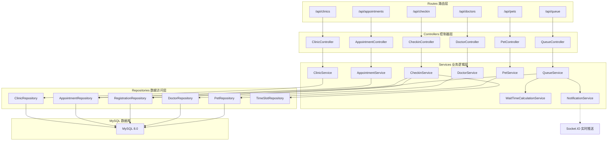
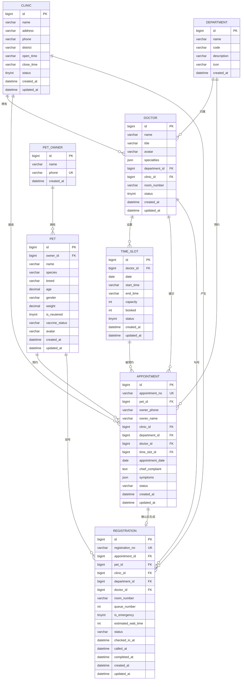

## 1. 架构设计

```mermaid
graph TD
    subgraph "Frontend 前端"
        A["React 18 + TypeScript"] --> B["Vite 构建工具"]
        A --> C["React Router DOM 路由"]
        A --> D["Zustand 状态管理"]
        A --> E["Tailwind CSS 样式"]
        A --> F["Lucide React 图标"]
    end

    subgraph "Backend 后端"
        G["Express.js 4"] --> H["API 路由层 Controllers"]
        H --> I["业务逻辑层 Services"]
        I --> J["数据访问层 Repositories"]
        J --> K["MySQL 数据库"]
        G --> L["Socket.IO 实时推送"]
    end

    subgraph "Shared 共享"
        M["TypeScript 类型定义"]
        N["数据校验 Schemas"]
    end

    F -.-> M
    H -.-> M
    I -.-> N
    L -.-> "候诊队列实时更新"
```

## 2. 技术说明

- **前端**：React@18 + TypeScript@5 + TailwindCSS@3 + Vite@5
- **初始化工具**：vite-init（react-express-ts 模板）
- **状态管理**：Zustand
- **路由**：React Router DOM@6
- **图标库**：Lucide React
- **后端**：Express@4 + TypeScript
- **数据库**：MySQL 8.0
- **实时通信**：Socket.IO（候诊队列实时推送）
- **HTTP 客户端**：Axios
- **数据校验**：Zod（前后端共享校验逻辑）

## 3. 路由定义

| 路由 | 页面 | 用途 |
|------|------|------|
| / | 首页 / 数据看板 | 今日预约概览、候诊统计、快捷入口 |
| /appointment | 预约挂号 | 多步骤预约挂号流程 |
| /queue | 候诊队列 | 各诊室候诊列表、叫号操作、预计等待时长 |
| /checkin | 挂号确认 | 前台到店确认、生成挂号单 |
| /clinics | 分院管理 | 分院列表、新增编辑分院 |
| /doctors | 医生管理 | 医生信息、出诊时段配置 |
| /pets | 宠物档案 | 宠物信息管理、就诊历史 |

## 4. API 定义

### 4.1 类型定义

```typescript
// 分院
interface Clinic {
  id: number;
  name: string;
  address: string;
  phone: string;
  district: string;
  openTime: string;
  closeTime: string;
  status: 'active' | 'inactive';
}

// 科室
interface Department {
  id: number;
  name: string;
  code: string;
  description: string;
  icon: string;
}

// 医生
interface Doctor {
  id: number;
  name: string;
  title: string;
  avatar: string;
  specialties: string[];
  departmentId: number;
  clinicId: number;
  roomNumber: string;
}

// 出诊时段
interface TimeSlot {
  id: number;
  doctorId: number;
  date: string;
  startTime: string;
  endTime: string;
  capacity: number;
  booked: number;
  status: 'available' | 'full' | 'closed';
}

// 宠物
interface Pet {
  id: number;
  ownerId: number;
  name: string;
  species: string;
  breed: string;
  age: number;
  gender: 'male' | 'female';
  weight: number;
  isNeutered: boolean;
  vaccineStatus: string;
  avatar: string;
}

// 预约
interface Appointment {
  id: number;
  appointmentNo: string;
  petId: number;
  ownerPhone: string;
  ownerName: string;
  clinicId: number;
  departmentId: number;
  doctorId: number;
  timeSlotId: number;
  appointmentDate: string;
  chiefComplaint: string;
  symptoms: string[];
  status: 'pending' | 'confirmed' | 'cancelled' | 'completed';
  createdAt: string;
}

// 挂号单
interface Registration {
  id: number;
  registrationNo: string;
  appointmentId: number;
  petId: number;
  clinicId: number;
  departmentId: number;
  doctorId: number;
  roomNumber: string;
  queueNumber: number;
  isEmergency: boolean;
  estimatedWaitTime: number;
  status: 'waiting' | 'visiting' | 'completed' | 'skipped';
  checkedInAt: string;
  calledAt?: string;
  completedAt?: string;
}
```

### 4.2 API 端点

| 方法 | 路径 | 说明 |
|------|------|------|
| GET | /api/clinics | 获取分院列表 |
| GET | /api/departments | 获取科室列表 |
| GET | /api/doctors?departmentId=&clinicId= | 按条件获取医生列表 |
| GET | /api/doctors/:id/timeslots?date= | 获取医生某日出诊时段 |
| POST | /api/appointments | 创建预约 |
| GET | /api/appointments?phone= | 按手机号查询预约 |
| POST | /api/checkin | 到店确认并生成挂号单 |
| GET | /api/queue?doctorId=&clinicId= | 获取诊室候诊队列 |
| POST | /api/queue/:registrationNo/call | 叫号 |
| POST | /api/queue/:registrationNo/complete | 完成就诊 |
| POST | /api/queue/:registrationNo/skip | 过号 |
| POST | /api/queue/:registrationNo/emergency | 标记急诊（插队） |
| GET | /api/pets?ownerPhone= | 查询宠物列表 |
| POST | /api/pets | 创建宠物档案 |

## 5. 服务器架构图



## 6. 数据模型

### 6.1 ER 图



### 6.2 DDL 语句

```sql
-- 分医院表
CREATE TABLE clinics (
    id BIGINT PRIMARY KEY AUTO_INCREMENT,
    name VARCHAR(100) NOT NULL COMMENT '分院名称',
    address VARCHAR(255) NOT NULL COMMENT '地址',
    phone VARCHAR(20) NOT NULL COMMENT '联系电话',
    district VARCHAR(50) COMMENT '所属区域',
    open_time VARCHAR(10) DEFAULT '09:00' COMMENT '开门时间',
    close_time VARCHAR(10) DEFAULT '21:00' COMMENT '关门时间',
    status TINYINT DEFAULT 1 COMMENT '状态 1-启用 0-停用',
    created_at DATETIME DEFAULT CURRENT_TIMESTAMP,
    updated_at DATETIME DEFAULT CURRENT_TIMESTAMP ON UPDATE CURRENT_TIMESTAMP
) ENGINE=InnoDB DEFAULT CHARSET=utf8mb4 COMMENT='分医院表';

-- 科室表
CREATE TABLE departments (
    id BIGINT PRIMARY KEY AUTO_INCREMENT,
    name VARCHAR(50) NOT NULL COMMENT '科室名称',
    code VARCHAR(30) NOT NULL UNIQUE COMMENT '科室编码',
    description VARCHAR(255) COMMENT '科室描述',
    icon VARCHAR(50) COMMENT '图标名称',
    created_at DATETIME DEFAULT CURRENT_TIMESTAMP
) ENGINE=InnoDB DEFAULT CHARSET=utf8mb4 COMMENT='科室表';

-- 医生表
CREATE TABLE doctors (
    id BIGINT PRIMARY KEY AUTO_INCREMENT,
    name VARCHAR(50) NOT NULL COMMENT '医生姓名',
    title VARCHAR(50) COMMENT '职称',
    avatar VARCHAR(255) COMMENT '头像URL',
    specialties JSON COMMENT '专业特长',
    department_id BIGINT NOT NULL COMMENT '科室ID',
    clinic_id BIGINT NOT NULL COMMENT '分院ID',
    room_number VARCHAR(20) COMMENT '诊室号',
    status TINYINT DEFAULT 1 COMMENT '状态 1-在职 0-离职',
    created_at DATETIME DEFAULT CURRENT_TIMESTAMP,
    updated_at DATETIME DEFAULT CURRENT_TIMESTAMP ON UPDATE CURRENT_TIMESTAMP,
    FOREIGN KEY (department_id) REFERENCES departments(id),
    FOREIGN KEY (clinic_id) REFERENCES clinics(id)
) ENGINE=InnoDB DEFAULT CHARSET=utf8mb4 COMMENT='医生表';

-- 出诊时段表
CREATE TABLE time_slots (
    id BIGINT PRIMARY KEY AUTO_INCREMENT,
    doctor_id BIGINT NOT NULL COMMENT '医生ID',
    date DATE NOT NULL COMMENT '出诊日期',
    start_time VARCHAR(10) NOT NULL COMMENT '开始时间',
    end_time VARCHAR(10) NOT NULL COMMENT '结束时间',
    capacity INT DEFAULT 5 COMMENT '可预约数',
    booked INT DEFAULT 0 COMMENT '已预约数',
    status TINYINT DEFAULT 1 COMMENT '1-可约 2-约满 0-关闭',
    created_at DATETIME DEFAULT CURRENT_TIMESTAMP,
    updated_at DATETIME DEFAULT CURRENT_TIMESTAMP ON UPDATE CURRENT_TIMESTAMP,
    FOREIGN KEY (doctor_id) REFERENCES doctors(id),
    UNIQUE KEY uk_doctor_date_time (doctor_id, date, start_time)
) ENGINE=InnoDB DEFAULT CHARSET=utf8mb4 COMMENT='出诊时段表';

-- 宠物主人表
CREATE TABLE pet_owners (
    id BIGINT PRIMARY KEY AUTO_INCREMENT,
    name VARCHAR(50) COMMENT '主人姓名',
    phone VARCHAR(20) NOT NULL UNIQUE COMMENT '手机号',
    created_at DATETIME DEFAULT CURRENT_TIMESTAMP
) ENGINE=InnoDB DEFAULT CHARSET=utf8mb4 COMMENT='宠物主人表';

-- 宠物表
CREATE TABLE pets (
    id BIGINT PRIMARY KEY AUTO_INCREMENT,
    owner_id BIGINT NOT NULL COMMENT '主人ID',
    name VARCHAR(50) NOT NULL COMMENT '宠物名',
    species VARCHAR(20) COMMENT '物种',
    breed VARCHAR(50) COMMENT '品种',
    age DECIMAL(4,1) COMMENT '年龄(岁)',
    gender VARCHAR(10) COMMENT '性别',
    weight DECIMAL(5,2) COMMENT '体重(kg)',
    is_neutered TINYINT DEFAULT 0 COMMENT '是否绝育 0-否 1-是',
    vaccine_status VARCHAR(100) COMMENT '疫苗状态',
    avatar VARCHAR(255) COMMENT '头像URL',
    created_at DATETIME DEFAULT CURRENT_TIMESTAMP,
    updated_at DATETIME DEFAULT CURRENT_TIMESTAMP ON UPDATE CURRENT_TIMESTAMP,
    FOREIGN KEY (owner_id) REFERENCES pet_owners(id)
) ENGINE=InnoDB DEFAULT CHARSET=utf8mb4 COMMENT='宠物表';

-- 预约表
CREATE TABLE appointments (
    id BIGINT PRIMARY KEY AUTO_INCREMENT,
    appointment_no VARCHAR(30) NOT NULL UNIQUE COMMENT '预约编号',
    pet_id BIGINT COMMENT '宠物ID',
    owner_phone VARCHAR(20) NOT NULL COMMENT '主人手机号',
    owner_name VARCHAR(50) COMMENT '主人姓名',
    clinic_id BIGINT NOT NULL COMMENT '分院ID',
    department_id BIGINT NOT NULL COMMENT '科室ID',
    doctor_id BIGINT NOT NULL COMMENT '医生ID',
    time_slot_id BIGINT COMMENT '时段ID',
    appointment_date DATE NOT NULL COMMENT '预约日期',
    chief_complaint TEXT COMMENT '主诉',
    symptoms JSON COMMENT '症状标签',
    status VARCHAR(20) DEFAULT 'pending' COMMENT 'pending待确认 confirmed已确认 cancelled已取消 completed已完成',
    created_at DATETIME DEFAULT CURRENT_TIMESTAMP,
    updated_at DATETIME DEFAULT CURRENT_TIMESTAMP ON UPDATE CURRENT_TIMESTAMP,
    FOREIGN KEY (pet_id) REFERENCES pets(id),
    FOREIGN KEY (clinic_id) REFERENCES clinics(id),
    FOREIGN KEY (department_id) REFERENCES departments(id),
    FOREIGN KEY (doctor_id) REFERENCES doctors(id),
    FOREIGN KEY (time_slot_id) REFERENCES time_slots(id)
) ENGINE=InnoDB DEFAULT CHARSET=utf8mb4 COMMENT='预约表';

-- 挂号单表
CREATE TABLE registrations (
    id BIGINT PRIMARY KEY AUTO_INCREMENT,
    registration_no VARCHAR(30) NOT NULL UNIQUE COMMENT '挂号编号',
    appointment_id BIGINT COMMENT '预约ID',
    pet_id BIGINT NOT NULL COMMENT '宠物ID',
    clinic_id BIGINT NOT NULL COMMENT '分院ID',
    department_id BIGINT NOT NULL COMMENT '科室ID',
    doctor_id BIGINT NOT NULL COMMENT '医生ID',
    room_number VARCHAR(20) COMMENT '诊室号',
    queue_number INT NOT NULL COMMENT '排队序号',
    is_emergency TINYINT DEFAULT 0 COMMENT '是否急诊 0-否 1-是',
    estimated_wait_time INT DEFAULT 0 COMMENT '预计等待时长(分钟)',
    status VARCHAR(20) DEFAULT 'waiting' COMMENT 'waiting候诊 visiting就诊中 completed已完成 skipped过号',
    checked_in_at DATETIME DEFAULT CURRENT_TIMESTAMP COMMENT '到店时间',
    called_at DATETIME COMMENT '叫号时间',
    completed_at DATETIME COMMENT '完成时间',
    created_at DATETIME DEFAULT CURRENT_TIMESTAMP,
    updated_at DATETIME DEFAULT CURRENT_TIMESTAMP ON UPDATE CURRENT_TIMESTAMP,
    FOREIGN KEY (appointment_id) REFERENCES appointments(id),
    FOREIGN KEY (pet_id) REFERENCES pets(id),
    FOREIGN KEY (clinic_id) REFERENCES clinics(id),
    FOREIGN KEY (department_id) REFERENCES departments(id),
    FOREIGN KEY (doctor_id) REFERENCES doctors(id)
) ENGINE=InnoDB DEFAULT CHARSET=utf8mb4 COMMENT='挂号单表';

-- 索引
CREATE INDEX idx_reg_doctor_status ON registrations(doctor_id, status);
CREATE INDEX idx_reg_clinic_status ON registrations(clinic_id, status);
CREATE INDEX idx_appointment_phone_date ON appointments(owner_phone, appointment_date);
```
