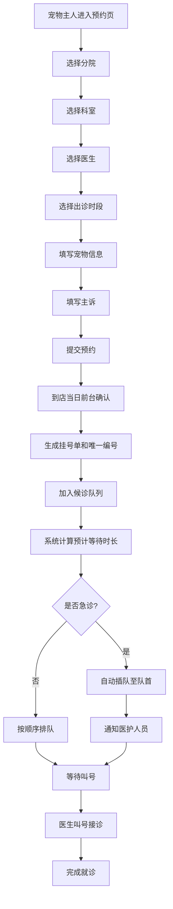

## 1. 产品概述

宠物医院集团连锁管理平台是一套面向多分院宠物医疗机构的综合管理系统，解决宠物医疗预约挂号、候诊队列管理等核心业务流程数字化问题。目标用户包括宠物主人、前台接待、医生、护士及集团管理人员。

该平台旨在提升宠物医院运营效率，优化宠物主人就诊体验，支持多分院统一管理和业务规模扩张。

## 2. 核心功能

### 2.1 用户角色

| 角色 | 注册方式 | 核心权限 |
|------|----------|----------|
| 宠物主人 | 手机号注册 | 预约挂号、查看候诊状态、管理宠物信息 |
| 前台接待 | 后台账号 | 预约确认、到店登记、挂号单生成、队列管理 |
| 医生 | 后台账号 | 查看候诊队列、叫号、管理出诊时段 |
| 管理员 | 后台账号 | 分院管理、科室管理、医生管理、数据统计 |

### 2.2 功能模块

1. **预约挂号页**：分院选择、科室选择、医生选择、出诊时段选择、宠物信息录入、主诉填写
2. **候诊队列页**：各诊室待诊列表、预计等待时长、急诊插队、叫号功能
3. **挂号确认页**：前台到店确认、挂号单生成、唯一编号展示
4. **数据看板**：今日预约量、候诊数量、分院就诊统计
5. **基础数据管理**：分院、科室、医生、宠物档案管理

### 2.3 页面详情

| 页面名称 | 模块名称 | 功能描述 |
|----------|----------|----------|
| 预约挂号页 | 分院选择模块 | 下拉选择分院，支持按区域筛选，展示分院地址和联系方式 |
| 预约挂号页 | 科室选择模块 | 卡片式展示内科/外科/骨科/眼科/皮肤科/牙科/猫科/异宠科，支持点击选中 |
| 预约挂号页 | 医生选择模块 | 根据科室筛选医生列表，展示头像、姓名、职称、专业特长、出诊时段 |
| 预约挂号页 | 时段选择模块 | 日期切换（今日/明日/后日），时段网格展示已约/可约状态 |
| 预约挂号页 | 宠物信息表单 | 宠物昵称、品种、年龄、性别、体重、是否绝育、疫苗状态 |
| 预约挂号页 | 主诉填写模块 | 常用症状标签快速选择 + 文本框详细描述 |
| 候诊队列页 | 诊室列表模块 | 按诊室分组展示当前候诊宠物，支持诊室筛选 |
| 候诊队列页 | 候诊卡片模块 | 展示挂号编号、宠物信息、预计等待时长、排队序号、是否急诊标记 |
| 候诊队列页 | 叫号操作模块 | 叫号、过号、完成就诊、急诊标记操作 |
| 候诊队列页 | 预计时长计算 | 基于历史平均诊疗时长和队列位置计算等待时间 |
| 挂号确认页 | 到店确认表单 | 输入预约手机号查询，确认到店后生成正式挂号单 |
| 挂号确认页 | 挂号单展示 | 展示唯一挂号编号、就诊信息、二维码 |

## 3. 核心流程

宠物主人通过预约挂号页面依次选择分院、科室、医生和时段，填写宠物信息和主诉后提交预约。预约当日到店后，前台通过挂号确认页面核实信息并确认到店，系统自动生成含唯一编号的挂号记录并将宠物加入对应诊室的候诊队列。医生通过候诊队列页面查看待诊列表，系统实时计算并展示每位宠物的预计等待时长。遇急诊情况，前台可将宠物标记为急诊，系统自动将其插队至队列最前端并通知相关医护人员。

## 4. 用户界面设计

### 4.1 设计风格

- **主色**：深青色 #0D9488（专业、信任、医疗感）
- **辅色**：橙色 #F97316（活力、宠物友好感）
- **中性色**：石灰色 Zinc 系列（层次分明的信息层级）
- **按钮风格**：圆角 pill 形按钮，主按钮采用实心填充配渐变阴影
- **字体**：标题使用 "Noto Serif SC" 宋体衬线，正文使用 "PingFang SC" 苹方无衬线
- **布局风格**：卡片式布局，圆角边框，柔和阴影，充足留白
- **图标风格**：使用 lucide-react 线性图标，统一 24px 尺寸

### 4.2 页面设计概览

| 页面名称 | 模块名称 | UI元素 |
|----------|----------|--------|
| 预约挂号页 | 步骤导航栏 | 顶部横向步骤条，当前步骤高亮，已完成步骤打勾，渐变色连接线 |
| 预约挂号页 | 科室卡片网格 | 2行4列网格布局，每卡片含图标+科室名+简介，选中态边框高亮+底部色条 |
| 预约挂号页 | 医生列表 | 横向信息条，左侧头像圆形，中部姓名/职称/特长标签，右侧出诊时段标签组 |
| 预约挂号页 | 时段网格 | 日期切换tab + 3列xN行时段格，可约态浅背景，已约态灰态禁用 |
| 候诊队列页 | 诊室Tab切换 | 顶部横向标签页切换诊室，当前页下划线加粗+色点指示 |
| 候诊队列页 | 候诊卡片 | 左侧大号序号，中间宠物名+挂号编号+预计时长，右侧状态徽章+操作按钮 |
| 候诊队列页 | 急诊标记 | 红色渐变背景角标 + 闪烁动画提示 |
| 挂号确认页 | 挂号单卡片 | 票据式设计，顶部唯一编号大字体，中部详情列表，底部二维码区 |

### 4.3 响应式

采用桌面端优先设计，移动端自适应：
- 桌面端（≥1024px）：多列网格布局，侧边导航 + 主内容区
- 平板端（768-1023px）：科室网格调整为2列，医生列表保持单行
- 移动端（<768px）：所有网格折叠为单列，步骤导航改为顶部进度条，操作按钮底部固定
- 触控优化：按钮最小尺寸44x44px，表单输入框增大触控区域

### 4.4 动效设计

- 页面进入：渐入 + 上滑组合动画，卡片式元素错峰延迟出现
- 候诊状态更新：新卡片从顶部滑入，状态变化时数字滚动动画
- 急诊插队：卡片红色高亮脉冲 + 队列重排过渡动画
- 按钮交互：hover 状态轻微上浮 + 阴影加深，click 状态缩放反馈
- 表单填写：输入框聚焦时底部描边动画延伸
